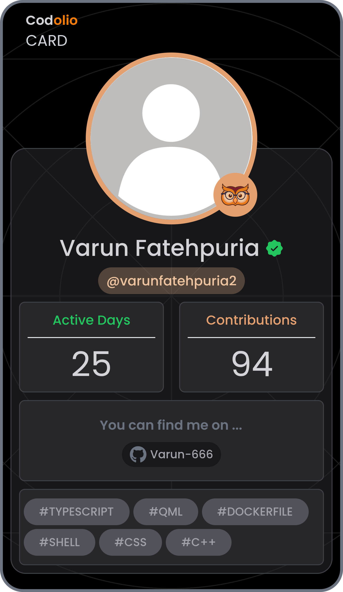
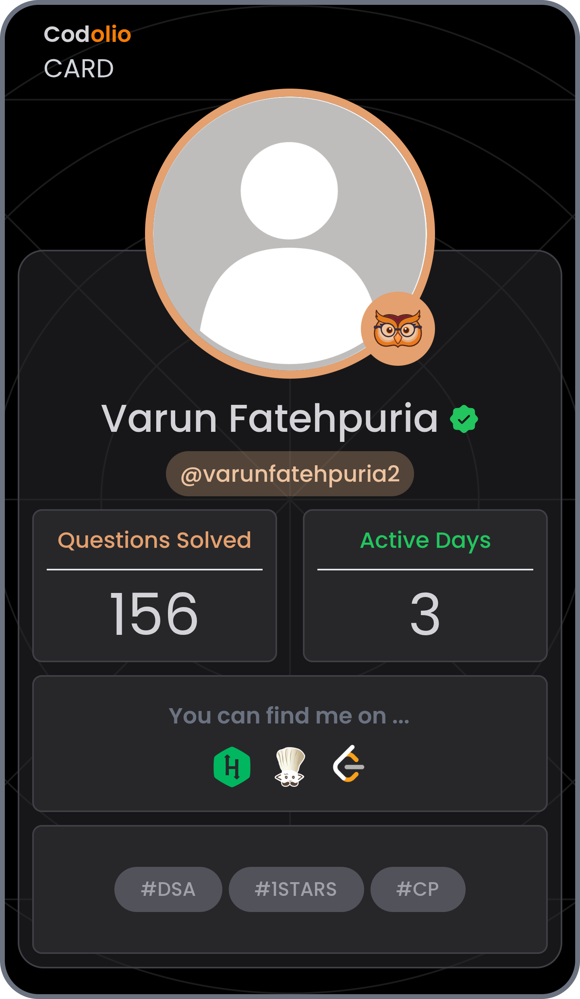

<h1 align="center">Hello 👋, I'm Varun Fatehpuria</h1>
<h3 align="center">A passionate UI/UX Designer, Graphic Designer</h3>

- 🔭 I’m currently working with **Open To Work**

- 🌱 I’m currently learning **Machine Learning**

- 📫 How to reach me **varunfatehpuria2@gmail.com**

<h3 align="left">My  Unity Learn Baddges</h3>

<h3 align="left">⚡Languages</h3>

 

 

<h3 align="left">🔧 Tools</h3>

<h3>📛 Holopin Hacktoberfest23 Badges</h3>

<!-- ### [🦉 My Codolio Card](https://codolio.com/profile/varunfatehpuria2/card)

 -->

<h3 align="left">🔗Connect with me:</h3>

 
 
 
 

